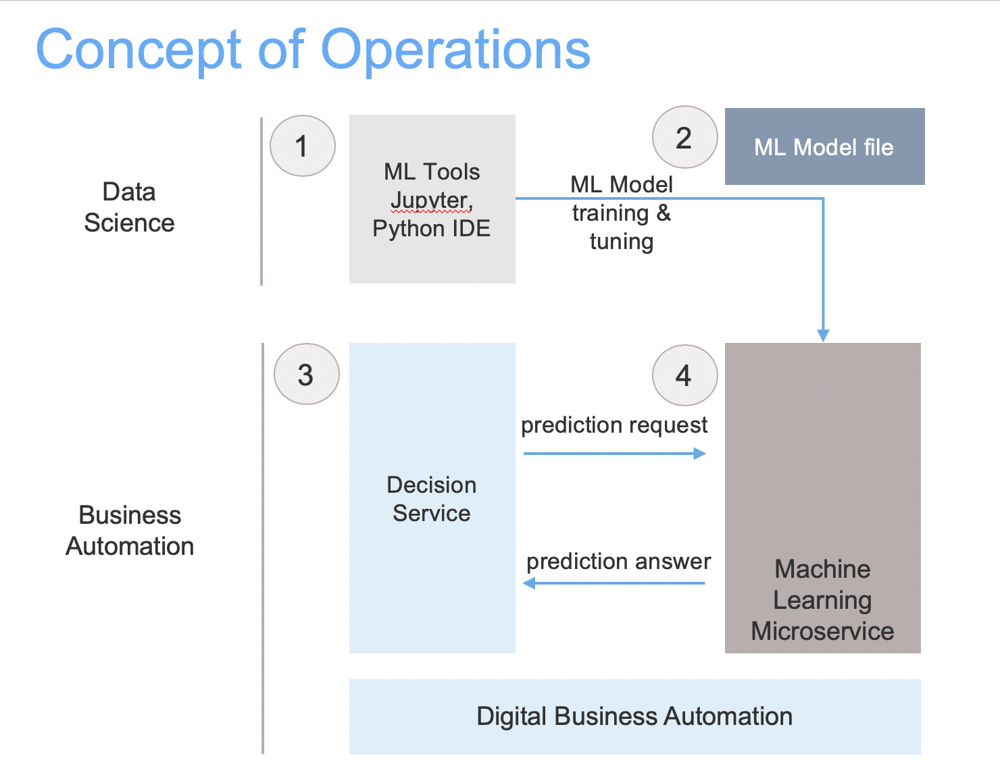

# Decision automation with machine learning

This repository demonstrates how IBM Decision Services can leverage ML predictive models hosted as micro services.

Material aims at tackling 3 challenges:
- how to host ML models in a simple and portable form factor,
- how to provide SDKs to easily consume ML driven predictions from remote applications,
- with the benefit of such SDK and ML micro service how to combine business rules and predictions in a decision service project.

The technical proposal fits with a concept of operations based on 3 main roles and 4 steps:
 - Step 1: A Data scientist elaborates an ML model in a data science tool.
 - Step 2: A Data scientist exports an ML model serialized in pickle or joblib.
 - Step 3: A developer takes the serialized ML model and hosts it as a microservice
 - Step 4: A Business user creates a decision service in IBM Digital Business Automation that invokes the hosted ML model
 
 

The approaches combines Python for ML, Docker and OpenAPI.

This repository is composed of 3 main parts:
- [ML microservice](ml-service/README.md): a micro service architecture to host ML models as REST APIs in a Docker container.
- [ML microservice sdk](ml-service-sdk/README.md): a sdk to remotely get a prediction from the microservice and manage the ML models.
- [Decision services](decision-services/README.md): project samples leveraging rules and ml to automate decisioning
   - miniloan project that leverages business rules the micro ml sdk to automate the processing of loan applications.
