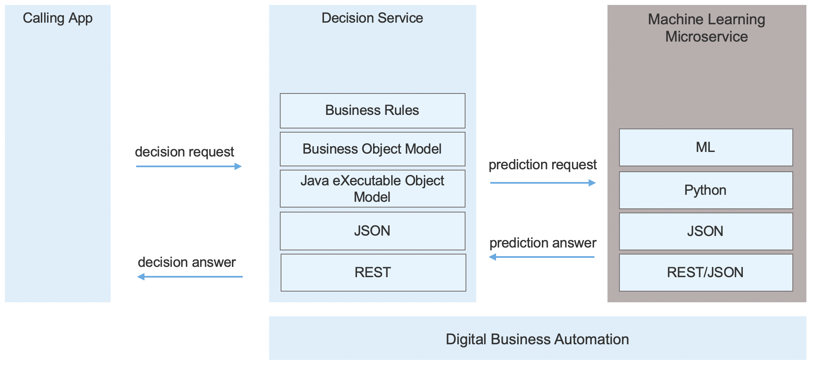

# Decision Service projects with ML

Decision services coming with IBM Digital Business Automation are able to consume predictions served my the dynamic ML micro service. To do so the IBM Operational Decision Manager project needs to:
- use the micro ML service sdk in its Java eXecutable Object Model,
- surface the prediction call to estimate a risk or opportunity captured through a machine learning model in its Business Object Model
- have one or more rules that calls one of predictions through a near natural language statement verbalized in English or any other suppported locale.

 

The decision service projects folder includes a miniloan project that leverages business rules the micro ml sdk to automate the processing of loan applications.
