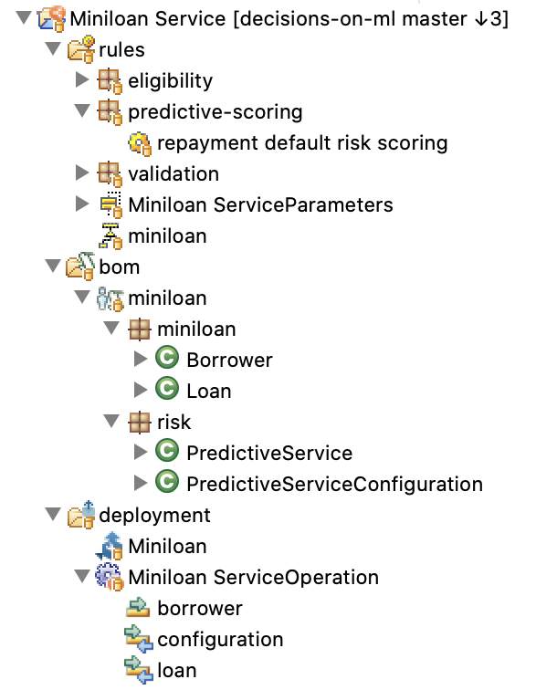
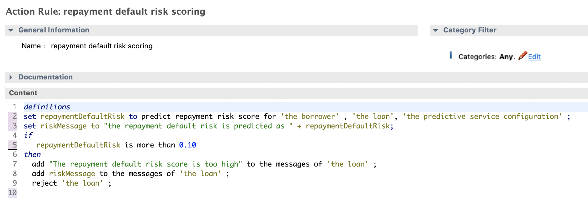

# MiniLoan Decision Service project with ML

This project is a variation of the sample project coming with IBM ODM.

Decision services coming with IBM Digital Business Automation are able to consume predictions served my the dynamic ML micro service. To do so the IBM Operational Decision Manager project needs to:
- use the micro ML service sdk in its Java eXecutable Object Model,
- surface the prediction call to estimate a risk or opportunity captured through a machine learning model in its Business Object Model
- have one or more rules that calls one of predictions through a near natural language statement verbalized in English or any other suppported locale.





 
The decision service projects folder includes a miniloan project that leverages business rules the micro ml sdk to automate the processing of loan applications.

The ready to use assets are:
- the RuleApp archive. This archive contains all you need to execute the rules and delegate a remote call to the micro ML service.
- The Decision Service project. It is the set of files as you can have it on your file system to import an Eclipse project for Rule Designer 8.10.3 or later.

## Test Scenarios

### Scenario 1
```console
Borrower borrower = new miniloan.Borrower("Joe", 600, 8000)
Loan loan = new miniloan.Loan(50000, 240, 0.05)
risk.PredictiveServiceConfiguration result = new risk.PredictiveServiceConfiguration("http://127.0.0.1:5000");
```

```console
class PredictionResponse {
    path: models/miniloandefault-rfc.joblib
    id: bf70a405-1a73-4b40-91a6-31d2de5bccdd
    prediction: 0
    probabilities: {0=0.9241445934859657, 1=0.07585540651403433}
}
false [Too big Debt-To-Income ratio]
```
### Scenario 2
```console
Borrower borrower = new miniloan.Borrower("Joe", 600, 120000)
Loan loan = new miniloan.Loan(500000, 240, 0.05)
risk.PredictiveServiceConfiguration result = new risk.PredictiveServiceConfiguration("http://127.0.0.1:5000");
```
```console
class PredictionResponse {
    path: models/miniloandefault-rfc.joblib
    id: c5c4e135-b6dd-4432-84f4-2176f8168fa1
    prediction: 0
    probabilities: {0=0.7096076123256951, 1=0.2903923876743048}
}
false [Too big Debt-To-Income ratio, The repayment default risk score is too high, the repayment default risk is predicted as 0.2903923876743048]
```
