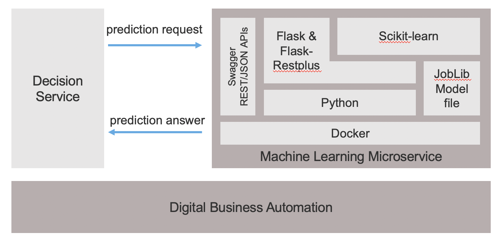

# A generic purpose ML micro service

### Moving forward a generic microservice to host any scikit-learn model. 

Technology stack is composed of Docker, Python, Flask, scikit-learn, and Joblib.

On request arrival for prediction, a Random Forest Classification model is loaded and run to predict a loan payment default.
Input parameters describing the loan are passed in JSON as the prediction returned by the service.
Same style of invocation for the classic Iris predictor.


 
 
## Build the ML microservice
```console
docker build . -t ml-microservice  -f ./Dockerfile
```
## Run the ML microservice
```console
docker run -p 3000:5000 -d ml-microservice 
```
Your predictive service is ready to predict on the 127.0.0.1:3000 port.
Note that you can run the server without Docker by starting main.py on your local environment. In this case adress will be 0.0.0.0:5000.

## Check
```console
docker ps ml-microservice 
```
You should see a running container for miniloanpredictionservice image.

## Test the prediction endpoint

Make sure that the service is up and responding.
```console
http://127.0.0.1:3000/isAlive  
```

Running locally the Docker container
```console
curl -d '{"request":{"creditScore":"300","income":"100000","loanAmount":"570189","monthDuration":"240","rate":"0.07","yearlyReimbursement":"57195"}}' -H 'Content-Type: application/json' http://0.0.0.0:3000/automation/api/v1.0/prediction
 ```
 
Running main.py on 0.0.0.0:5000
```console
curl -d '{"request":{"creditScore":"300","income":"100000","loanAmount":"570189","monthDuration":"240","rate":"0.07","yearlyReimbursement":"57195"}}' -H 'Content-Type: application/json' http://0.0.0.0:5000/automation/api/v1.0/prediction
 ```
 
With the following JSON request
```console
{
    "model":" {
        "name": toto",
        "version":"1.0",
        "format": "joblib"
        }
    "features": {
        "creditScore": "300",
        "income": "100000",
        "loanAmount": "570189",
        "monthDuration": "240",
        "rate": "0.07",
        "yearlyReimbursement": "57195"
    }
}
```
You should receive an answer like
```console
{
    "id": "123",
    "probabilities": {
        "0": 0.6717663255260751,
        "1": 0.32823367447392493
    }
}
```
